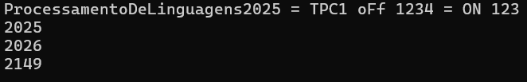

# TPC1 - Somador On/Off
## 2025-02-10
### Inês Silva Marques - A104263


Para este TPC foi pedido que implementássemos um pequeno programa em python, que, dado um texto, some os números naturais (sequências de dígitos, ignorando o sinal) presentes no texto, parando de somar quando encontra a palavra **'off'** e voltando quando encontra **'on'** (sem ter em conta diferença de maiúsculas e minúsculas).
Era também pretendido que, quando fosse encontrado o carácter **'='**, fosse impressa no ecrã a soma atual, e optei por mostrar a soma no final da linha também, para ser mais fácil ver os resultados.

Utilização:
Executar o ficheiro [somador.py](somador.py) e escrever na linha de comandos o texto pretendido.
```
$ py somador.py
```

Exemplo de resultado:

(A primeira linha é o input e as seguintes correspondem ao resultado)

